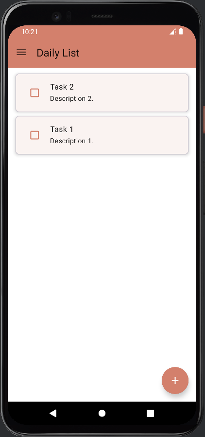
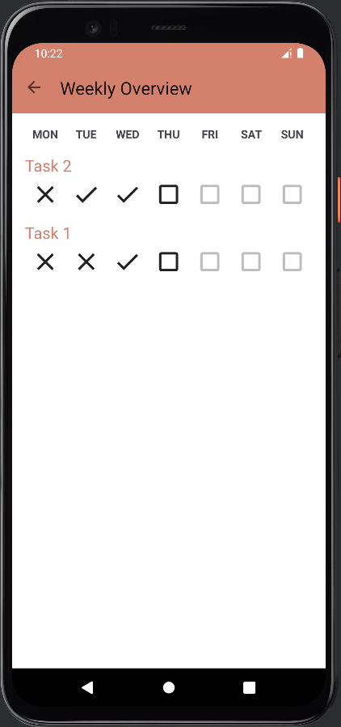
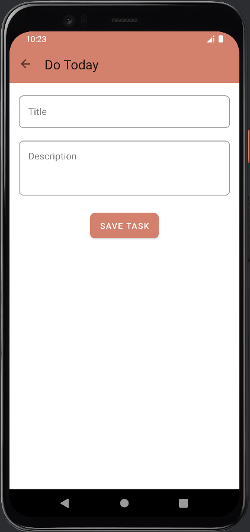

# 📋 DoToday - To-Do List & Weekly Goals Tracker

DoToday is an Android application that helps users create to-do lists and track their goals by marking tasks as completed. It also features a weekly view to easily monitor how many goals have been achieved during the week. The app is built following the MVVM architecture, utilizing Room components such as DAO, Entity, and Database.

### ✨ Features

- Create, update, and delete tasks  
- Weekly view to track progress  
- Uses Room database with DAO and Entity  
- MVVM architecture implementation  
- LiveData & ViewModel integration for reactive UI  

### 🛠️ Technologies Used

- Kotlin  
- Android Jetpack (Room, LiveData, ViewModel)  
- MVVM Architecture  
- RecyclerView  
- Material Design  

### 🚀 Installation

1. Clone the project:  
```bash
git clone https://github.com/Brkcidem/DoToday.git
```

2. Open the project in Android Studio

3. Run the application

## 📱 Screenshots





## 🔧 Development

To contribute to the project:

1. Create a new branch
2. Make your changes
3. Submit a pull request

## 📝 License

This project is licensed under the MIT License. See the [LICENSE](LICENSE) file for details.

## 👤 Author

Burakhan Çidem - [GitHub](https://github.com/Brkcidem)

## 🙏 Acknowledgments

- Android developer community
- All contributors
